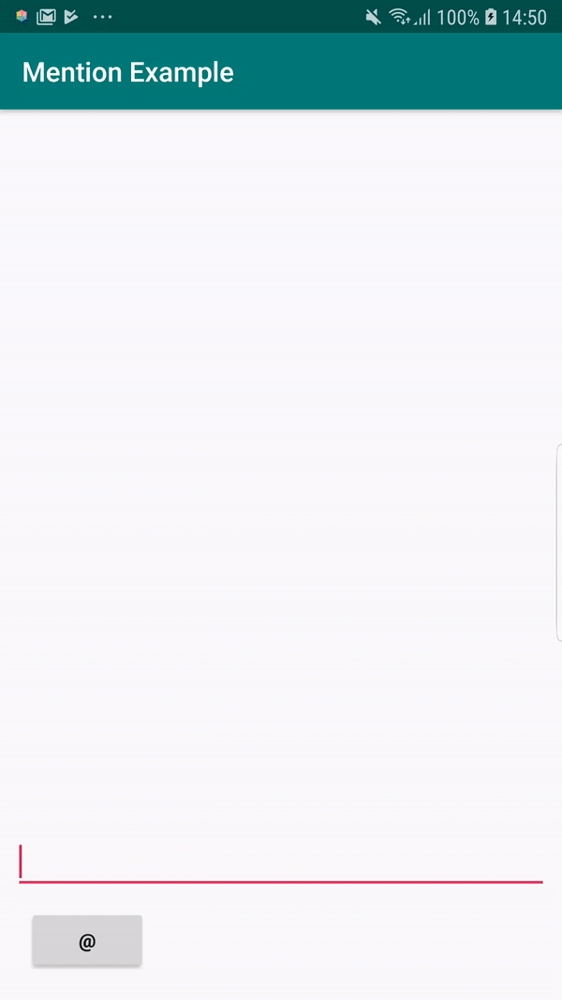

# Mention
A powerful Android library that provides highly-customizable widgets (with smart defaults) to easily add social-media-esque mention (aka tag) support to your app

*For a broad overview, check out our [blog post](http://androidorion.com) at the LinkedIn engineering blog.*

Features
--------

- A subclass of `EditText` that contains enhanced functionality in order to tokenize user input and display mentions
- Designed to handle suggestions dynamically as are retrieved from multiple data sources
- Supports both implicit and explicit (i.e. "@User Name") mentions

Getting Started
---------------

Just copy this project and get the mention module. Enjoy it!

Overview
---------------

Mention is divided into three, customizable layers: *tokenization*, *suggestions*, and *mentions*. Together, these layers form the update lifecycle used within Mention:

1. User types a character
2. Tokenize input
3. Generate and display suggestions
4. User taps a suggestion
5. Insert and display mention

Let's talk about each layer individually:

### Tokenization

After the user types a character, Mention will use a tokenizer to determine which part of the inputted text it should be considering and whether it could be a valid mention. While you may create your own tokenizer, most people should use the highly-configurable default tokenizer, the `WordTokenizer`. Here are some of the features you can define and customize:

- Define characters that will trigger an explicit mention (defaults to the '@' character)
- Set the number of characters required to have been typed in the current word before displaying any suggestions (defaults to 3)
- Define the maximum number of words to return as part of your current token (defaults to 1). This option would allow you to recommend suggestions based on more than just the currently-typed word (i.e. if value is 2 and user has typed "New Mex", you could recommend "New Mexico" before just "Mexico")
- Set which characters are considered word-breaking and line-breaking characters by the tokenizer (defaults to spaces, periods, and newline characters)

For more information about implementation and configuration options, see the documentation in the `WordTokenizer` class.

If the input being inspected by the tokenizer is currently valid, it will generate a `QueryToken` containing the keywords that will ultimately be used to generate suggestions.

### Mentions

All mentions that Mention insert must be a subclass of the `MentionSpan`. By default, you can easily tweak how your mentions appear (i.e. highlight and text colors). Additionally, you may alter how they behave when they are deleted via multi-stage deletions. We use this extensively in the LinkedIn app to allow users to delete only the last name of a mentioned member (leaving just the first name).

Usage
-----

To use Mention, you have to use the `MentionsEditText`.

The `MentionsEditText` is a subclass of `EditText`. It contains extra functionality for tokenizing user input into query tokens and inserting new mentions to be displayed. Note that it does not have any view associated with displaying suggestions. You must provide that. This gives you the most power to customize how your mentions-enabled text box feels and behaves. See the "Grid Mentions" example in the sample app for a demo.

Sample App
----------

The ''Mention-sample'' app contains several examples of using the library.

